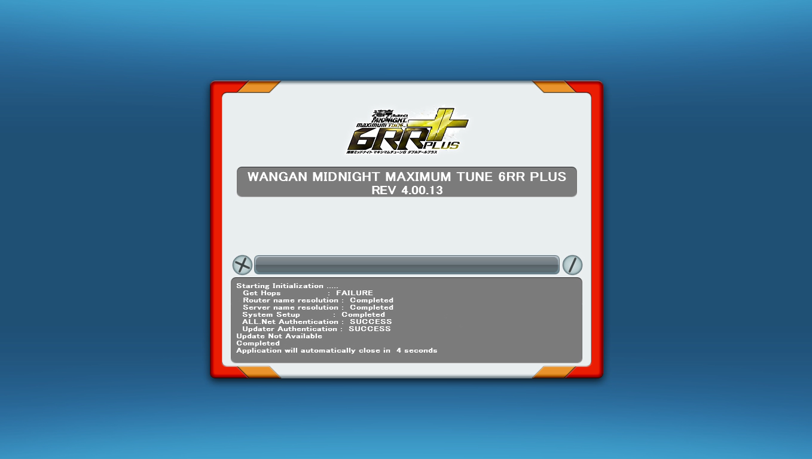

# OpenParrot-6RR-PLUS
Hyperspecialised fork of OpenParrot for Wangan Midnight Maximum Tune 6RR PLUS. Also support other version like WMMT5, 5DX, 5DX+ etc.

## Disclaimer
The code is bit messed. But it's confirmed that this will worked with 6RR PLUS Rev. 4.00.13.

## Features 
 - Have a Arcade Cab Startup.

(It doesn't have any bug but I guess I need to patch the AMUpdater.exe soon to avoid any upcoming issue.)

## Support status

| Game | Revision | Status | Regions |
|:----:|:----:|:--------:|:--------:|
| WMMT5 | `1.05.00` | `Perfect` | `JPN` |
| WMMT5DX | `2.00.02` | `Perfect` | `JPN` |
| WMMT5DX+ | `3.00.05` | `Perfect` | `JPN` |
| WMMT6 | `1.05.03` | `Perfect` | `JPN` |
| WMMT6R | `2.00.08` | `Perfect` | `JPN` |
| WMMT6RR | `3.05.03` | `Perfect` | `JPN` |
| WMMT6RR | `3.10.??` | `In progress` | `EXP` |
| WMMT6RR+ | `4.00.13` | `Working with minor issue` | `JPN` |
| WMMT6RR+ | `4.01.04` | `In progress` | `JPN` |
| WMMT6RR+ | `4.02.??` | `Not yet` | `JPN` |
| WMSI | `1.00.??` | `Not working dude.` | `JPN` |

## Bug
 - Sometimes, the revision is wrongly displayed when you try boot the game. It will be fix soon.
 - Sometimes, the game is stuck on update check when boot. For temporary fix, just reacquire the network status on Test Menu.

## Note
 - On [AmAuthGame64.cpp](./OpenParrot/src/Functions/Games/ES3X/AmAuthGame64.cpp), change the `cacfg-auth_server_url` to your desired update server URL (example: https://wangan.network:10082) to avoid any bug.

## How to use
Don't, yet. (But you'd be able to use it with TeknoParrotUI or something.)

## Special thanks
 - [Emi (PockyWitch)](https://twitter.com/ChocomintPuppy) - code, protocol analysis, info etc
 - [derole](https://derole.co.uk) - protocol help, info
 - [The Wangan Midnight Emulation Discord](https://discord.gg/kukM3Y7Uwv) - being the reason I started doing this in the first place
 - [Ultra Fusion Hacker (WhiteSmileingMan)](https://github.com/WhiteSmileingMan) - working with the code, game test etc.
 - [Krishy](https://github.com/Krisssss532) - bug fixing
 - [Pixel (valkyrieasyraf)](https://github.com/valkyrieasyraf) - network help
 - C.Y (idk what his social link/github)- network fix, bug fixing
